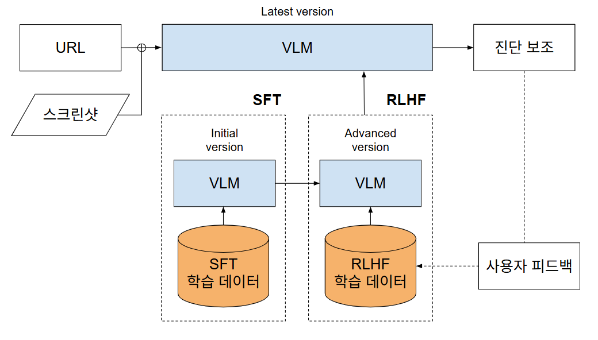

# 🌐 AI 기반 웹 접근성 진단 자동화 파이프라인

이 프로젝트는 **웹 접근성 진단 프로세스 전체를 자동화**하기 위해 여러 모듈을 결합한 파이프라인을 제공합니다.  
흐름은 다음과 같습니다:

1. **추론 데이터 생성** (PPTX 추출기, 크롤링 데이터 등)  
2. **SFT 학습**  
   - AWS Bedrock 기반 **LLMOps 버전**  
   - Hugging Face 기반 **로컬 학습 버전**  
3. **모델 추론**

---

## 📌 전체 구조




---

## 📂 모듈별 설명

### 1. 📊 추론 데이터 생성
- **PPTX Accessibility Dataset Extractor**
  - 진단 보고서 PPTX 슬라이드 → JSONL 학습 데이터 변환
  - 필드 추출: 페이지명, URL, 검사항목, 오류유형, 개선 방안(텍스트/코드)
  - LLM 호출로 `rationale` 생성 (옵션)
  - 결과: `train/<pptx>.jsonl` + 슬라이드 이미지

---

### 2. 🏋️ SFT 학습
#### (1) AWS Bedrock 기반 LLMOps 버전
- 데이터 전처리: JSONL → Bedrock Conversation 형식
- `create_model_customization_job`으로 Fine-tuning 실행
- Provisioned Throughput 설정 및 추론 테스트
- SageMaker Pipeline으로 학습~추론 자동화

#### (2) Hugging Face 기반 로컬 학습 버전
- `train.ipynb`에서 실행
- Hugging Face `transformers`로 모델 로드 및 학습
- 로컬 GPU 환경 또는 Colab에서 실행 가능
- 체크포인트(`./checkpoints/`) 저장

---

### 3. 🔮 모델 추론
- **`inferecne.ipynb`**
  - 학습된 모델 로드
  - 새로운 입력 데이터에 대한 진단 결과 생성
  - 출력: JSON / 로그 / 결과 시각화

---

## ⚙️ 설치

```bash
git clone <this-repo>
cd <this-repo>
pip install -r requirements.txt
```

환경 변수:
```bash
export OPENAI_API_KEY=your_api_key_here
export AWS_PROFILE=your_profile   # Bedrock 학습/추론용
```

---

## 🚀 실행 흐름

1. **데이터 생성**
   - `extract_pptx_accessibility.py` 실행 → JSONL 학습 데이터

2. **SFT 학습**
   - AWS Bedrock LLMOps 파이프라인 실행  
   - 또는 Hugging Face `train.ipynb` 실행

3. **모델 추론**
   - `inferecne.ipynb` 실행 후 결과 확인

---

## 📊 출력 예시
- 사이트맵: `sitemap_output.xlsx`  
- 학습 데이터: `train/<pptx>.jsonl`  
- 학습된 모델: Bedrock Custom Model ARN 또는 Hugging Face 체크포인트  
- 추론 결과: JSON / 시각화 / 로그  

---

## 🛡️ 주의사항
- Selenium 실행에는 크롬 드라이버 필요  
- Bedrock SFT/Provisioned Throughput은 리전/계정별 제약 있음  
- OpenAI API 및 AWS Bedrock 모두 비용 발생 가능  
- 대규모 PPTX 또는 사이트 크롤링 시 처리 시간이 길어질 수 있음  
