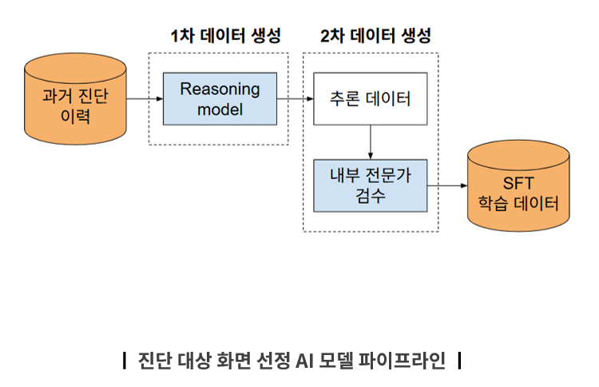

## Pipeline



# PPTX Accessibility Dataset Extractor

This script extracts images and metadata from accessibility diagnosis PPTX slides,
then (optionally) calls a reasoning model to generate a rationale. It writes
JSONL suitable for training and saves images to a folder.

## What it does
1. Extracts slide images to `./train/<pptx_basename>/s###_p##.png`
2. Parses Korean-labeled fields:
   - 페이지명, URL, 검사항목, 오류유형
   - 문제점 및 개선 방안(텍스트)
   - 개선 방안(코드)
3. Builds a prompt (provided in your instructions) and generates a `rationale`
   using an OpenAI model (e.g., `gpt-4o`). If no API key is provided or `--dry-run`
   is passed, the rationale is left empty.
4. Writes one JSON per slide to `./train/<pptx_basename>.jsonl`.

## Install
```bash
pip install -r requirements.txt
```

## Run
```bash
python extract_pptx_accessibility.py your.pptx --model gpt-4o --openai_api_key $OPENAI_API_KEY
```

Provide a guideline file (plain text or markdown) if you want the model to
reference it inside the prompt:
```bash
python extract_pptx_accessibility.py your.pptx --guide-file guide.md --openai_api_key $OPENAI_API_KEY
```

For a quick test without model calls:
```bash
python extract_pptx_accessibility.py your.pptx --dry-run
```

## Notes
- Text parsing uses heuristics and label aliases. Adjust `KOREAN_FIELD_ALIASES`
  or `_parse_fields_from_texts()` if your slide templates vary.
- If your PPTX stores code blocks in shapes, they will be captured by the block
  parser under **개선 방안(코드)**.
- The prompt template is embedded in the script (`PROMPT_TEMPLATE`) and mirrors
  the sample you provided.