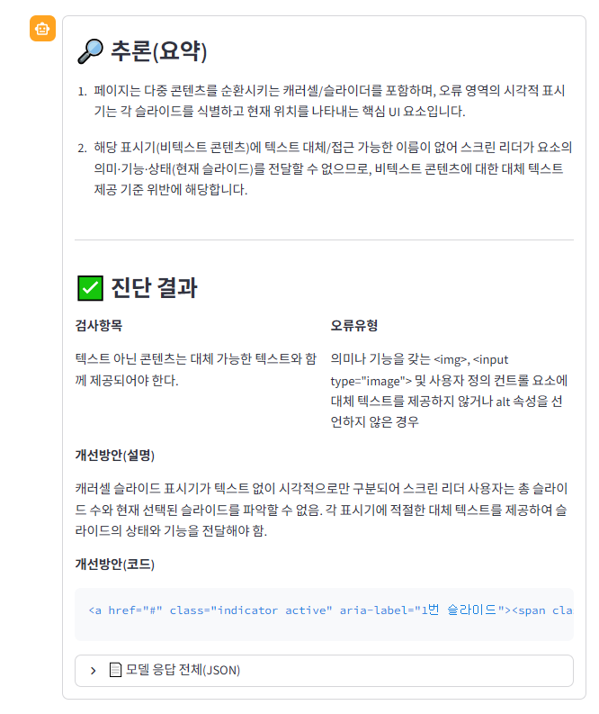

# VLM 모델의 접근성·진단 능력 평가 페이지 (Streamlit) 

[평가 페이지 링크](https://snclab-rl.streamlit.app/)


**목적**  
이 앱은 이미지+텍스트 입력을 받아 **외부 LLM/VLM 엔드포인트**(OpenAI-호환, AWS Bedrock, **Vertex AI 튜닝 Gemini 2.5 Pro**)를 호출하고, 전문가의 **검증·편집·피드백**을 수집하여 **JSONL**로 자동 축적합니다. 수집된 데이터는 버튼 한 번으로 **Hugging Face Hub**에 업로드할 수 있습니다.

---

## 기능 요약

- **멀티모달 입력**: 텍스트 + (선택) 이미지 업로드  
- **모델 호출**:  
  - OpenAI-compatible (LangChain `ChatOpenAI`)  
  - AWS Bedrock (LangChain `ChatBedrock`)  
  - **Vertex AI (튜닝된 Gemini 2.5 Pro 엔드포인트)** – `google-genai` v1 사용
- **HITL 평가**: 응답 편집, 만족도(1–5), 코멘트 입력
- **데이터 축적**: `hf_export/data.jsonl`로 자동 append, 이미지 파일은 `hf_export/images/`
- **허깅페이스 업로드**: dataset repo 로 push

## 💻 UI 미리보기

<table>
  <tr>
    <td align="center" style="vertical-align: top;">
      <br/>
      <sub><b>그림 1.</b> AI 출력 화면</sub>
    </td>
    <td align="center" style="vertical-align: top;">
      <br/>
      <sub><b>그림 2.</b> 전문가 피드백 화면</sub>
    </td>
  </tr>
</table>

---

## 1. 빠른 시작

### 요구사항
- Python 3.9+
- (선택) OpenAI API 키
- (선택) AWS 자격증명
- (선택) **GCP 인증 (ADC or 서비스계정 JSON)**

### 설치
```bash
# 가상환경(권장)
python -m venv .venv
# macOS/Linux
source .venv/bin/activate
# Windows
# .venv\Scripts\activate

pip install --upgrade pip
pip install streamlit langchain langchain-openai langchain-core huggingface_hub google-genai
# Bedrock을 사용할 경우:
# pip install langchain-aws
```

### 실행
```bash
streamlit run app.py
```
브라우저가 `http://localhost:8501`로 열립니다.

---

## 2. 인증(Provider별)

### A) Vertex AI (튜닝된 Gemini 2.5 Pro 엔드포인트)

**방법 1. ADC(권장, JSON 불필요)**  
```bash
gcloud auth application-default login
gcloud config set project <YOUR_PROJECT_ID>
```
> Windows에서 `where gcloud`가 안 잡히면 PATH에 아래 경로를 추가하거나 절대경로로 실행하세요.  
> `C:\Users\<YOU>\AppData\Local\Google\Cloud SDK\google-cloud-sdk\bin`

**방법 2. 서비스 계정 JSON 업로드(앱 내)**  
사이드바의 “Google 인증(서비스 계정 JSON 업로드)”에서 JSON을 올리면 코드가 메모리에서 바로 인증합니다.  
- 서비스 계정 권한: **Vertex AI User**  
- 라이브러리: `google-genai >= 0.6.0`

### B) OpenAI-compatible
- 사이드바에 **API Key**(필수), **Base URL**(선택), **Model** 입력

### C) AWS Bedrock
- 사이드바에 **Region**, **Model ID** 입력  
- 로컬에 AWS 자격증명 구성(IAM 사용자/역할)

---

## 3. 사용법 (화면 흐름)

1) **사이드바 → 모델 설정**  
   - Provider 선택 → 연결 정보 입력 → **Connect**  
   - 연결 성공 시 초록 배지 표시. 연결 정보/객체는 `session_state`에 저장되어 재실행 후에도 유지됩니다.

2) **입력**  
   - (선택) 이미지 업로드(PNG/JPG/JPEG/WEBP)  
   - 프롬프트(텍스트) 작성 → **모델 호출**  
   - 타임라인에 사용자 입력과 모델 응답이 순서대로 뜹니다.

3) **검증·편집·피드백**  
   - 모델 응답을 **편집(선택)**  
   - **점수(1–5)**, **작업유형**(`open_ended|rag_qa|summarization|classification|coding`) 선택  
   - **코멘트** 입력 → **📝 피드백 저장(JSONL에 추가)**  
   - 저장 즉시 `hf_export/data.jsonl`에 append, 이미지가 있었다면 `hf_export/images/`에 파일 저장 및 해시 기록

4) **데이터셋 내보내기**  
   - `data.jsonl` 다운로드 또는 **Hugging Face Hub로 Push**  
   - Repo, 토큰, 저장 경로 지정 후 버튼 클릭

---

## 4. 데이터가 저장되는 곳과 형식

### 디렉터리 구조
```
hf_export/
├─ data.jsonl          # 평가 레코드 누적
└─ images/             # 업로드된 원본 이미지 저장
```

### JSONL 레코드 예시
```json
{
  "id": "uuid4",
  "ts": 1731300000,
  "task_type": "rag_qa",
  "provider": "vertex",
  "model_name": "projects/.../endpoints/1824...",
  "user_text": "창고 설계 기준 알려줘",
  "model_text_original": "모델 응답 원문",
  "model_text_edited": "전문가가 수정한 응답(선택)",
  "feedback_score": 4,
  "feedback_comment": "출처 근거 보강 필요",
  "image": {
    "path": "hf_export/images/abcd.png",
    "sha256": "e3b0c44298...",
    "mime": "image/png"
  }
}
```

---

## 5. 지원 모델/제한

- **OpenAI-compatible**: 비전 모델이면 이미지가 `data:` URL로 전달됩니다.  
- **Vertex AI 튜닝 엔드포인트**: 이미지는 `inline_data`(바이너리)로 전달합니다.  
  - 멀티모달 미지원 튜닝 구성인 경우 이미지 포함 호출이 실패할 수 있습니다 → 텍스트만으로 호출해 보세요.
- **Bedrock**: 모델별 입력 포맷/멀티모달 지원이 상이합니다.

---

## 6. 문제 해결(FAQ)

**Q1. “Your default credentials were not found”**  
- ADC 미설정.  
  - `gcloud auth application-default login` 후 `gcloud config set project ...`  
  - 또는 앱에서 **서비스 계정 JSON 업로드** 사용

**Q2. Windows에서 `where gcloud`가 안 됨**  
- PATH 미설정. 설치 위치 확인 후 PATH 추가:  
  `C:\Users\<YOU>\AppData\Local\Google\Cloud SDK\google-cloud-sdk\bin`  
  또는 절대경로 `"...\gcloud.cmd"`로 실행

**Q3. “사이드바에서 모델 연결…” 경고가 다시 뜸**  
- Streamlit 재실행으로 LLM 객체가 사라진 경우 → 앱은 `st.session_state.llm`에 보존 처리됨.  
  그래도 뜬다면 Provider를 바꾸지 않았는지 확인 후 **다시 Connect**.

**Q4. StreamlitDuplicateElementId**  
- 같은 라벨의 `text_input`이 두 번 렌더됨 → Vertex 블록 하나만 남기거나 `key="..."` 지정(본 레포 반영).

**Q5. 이미지가 있을 때만 실패**  
- 해당 엔드포인트가 **멀티모달 미지원**일 수 있습니다. 같은 프롬프트를 **이미지 없이** 호출해 보세요.

---

## 7. 개발 메모

- Vertex 호출은 `google-genai` v1 클라이언트를 **Vertex 모드**로 생성:
  ```python
  genai.Client(vertexai=True, project=..., location=..., credentials=...)
  ```
- 연결된 모델 객체를 `st.session_state.llm`에 저장하여 재실행에도 보존합니다.
- JSONL 스키마는 확장 가능(예: RAG 근거 문서 `context_docs` 추가).

---

## 8. 보안/개인정보

- 서비스 계정 JSON을 **앱에 업로드하는 경우**, 파일을 디스크에 저장하지 않고 메모리에서 `Credentials` 객체로 사용합니다.  
- 데이터셋에 **개인정보/기밀**을 포함할 경우 업로드 전에 반드시 익명화/정책 검토를 하세요.

---

## 9. 명령어 치트시트

```bash
# 실행
streamlit run app.py

# Vertex ADC (PATH 설정이 되어 있을 때)
gcloud auth application-default login
gcloud config set project golden-cove-474806-r1

# PATH 없이 절대경로로 gcloud (Windows 예시)
"C:\Users\Administrator\AppData\Local\Google\Cloud SDK\google-cloud-sdk\bin\gcloud.cmd" --version
```

---

## 10. 라이선스/문의
- 사내·연구용 템플릿으로 사용하세요.  
- 버그/기능요청은 이슈로 남겨 주세요.
