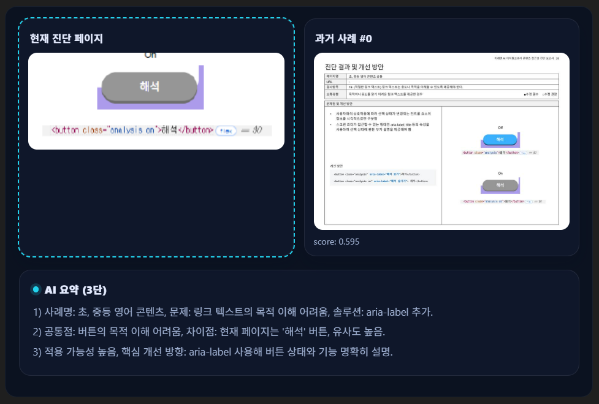

# 🔎 Multimodal RAG for Similar Page Retrieval



이 프로젝트는 **웹 접근성 진단 자동화**를 위한 보조 도구로,  
현재 진단하고자 하는 페이지와 **유사한 구조/내용을 가진 다른 페이지를 검색**하는 파이프라인을 구현한 Jupyter Notebook입니다.  

텍스트(페이지 콘텐츠)와 이미지(스크린샷, UI 요소) 등 멀티모달 데이터를 활용하여,  
임베딩 → 검색(Retrieval) → 응답 생성 과정을 통해 **“비슷한 페이지 후보군”**을 제안합니다.  

---

## 📌 주요 기능
- **멀티모달 임베딩 생성**
  - HTML 텍스트, 페이지 스크린샷 등 다양한 입력을 임베딩으로 변환
  - 유사도 검색이 가능하도록 벡터 DB에 저장  

- **유사 페이지 검색**
  - 사용자가 특정 “진단 대상 페이지”를 선택하면, 해당 페이지의 임베딩을 생성
  - 벡터 DB에서 가장 유사도가 높은 페이지들을 Top-k로 검색  

- **결과 해석**
  - 검색된 페이지의 URL, 계층 트리, 주요 UI 요소 라벨 등을 함께 반환
  - 필요 시 LLM을 활용해 “왜 유사한지”에 대한 설명 생성  

---

## ⚙️ 요구 사항
- Python >= 3.9
- 필수 패키지:
  - torch, transformers
  - sentence-transformers (텍스트/멀티모달 임베딩)
  - faiss 또는 chromadb (벡터 검색)
  - openai (LLM reasoning 사용 시)
  - pandas, numpy

설치:
```bash
pip install -r requirements.txt
```

---

## 🚀 실행 방법
1. 노트북 실행
```bash
jupyter notebook multimodal_RAG.ipynb
```

2. 단계별 워크플로우
   1. 데이터셋 준비 (진단 대상 페이지 + 비교 대상 페이지들)
   2. 임베딩 생성 및 벡터 DB 구축
   3. 쿼리 페이지 입력
   4. 유사 페이지 검색 결과 확인 (Top-k 후보)
   5. 필요 시 LLM으로 결과 요약/설명  

---

## 📊 예시 시나리오

- 사용자가 특정 진단 대상 페이지(URL/스크린샷)를 입력  
- RAG 파이프라인이 유사한 레이아웃과 UI 패턴을 가진 페이지들을 찾아 반환  
- 예:  
  - 입력: 고객지원 > FAQ 페이지  
  - 출력: 제품 > Q&A, 서비스 > 도움말, 지원센터 > 자주 묻는 질문  

---

## 📎 참고
- **목적**: 중복되거나 비슷한 화면을 자동으로 식별 → 진단 리소스 최적화  
- **장점**: 사람이 일일이 사이트맵을 비교하지 않고, AI가 빠르게 후보군을 제시  

---

## 🛡️ 주의사항
- 충분한 데이터(페이지 HTML, 이미지)가 있어야 정확한 검색 결과 제공 가능  
- OpenAI API 키 또는 Hugging Face Hub 토큰 필요 (환경 변수 설정 권장)  
- 대규모 사이트에서는 검색 속도를 고려해 벡터 DB를 최적화해야 함  
