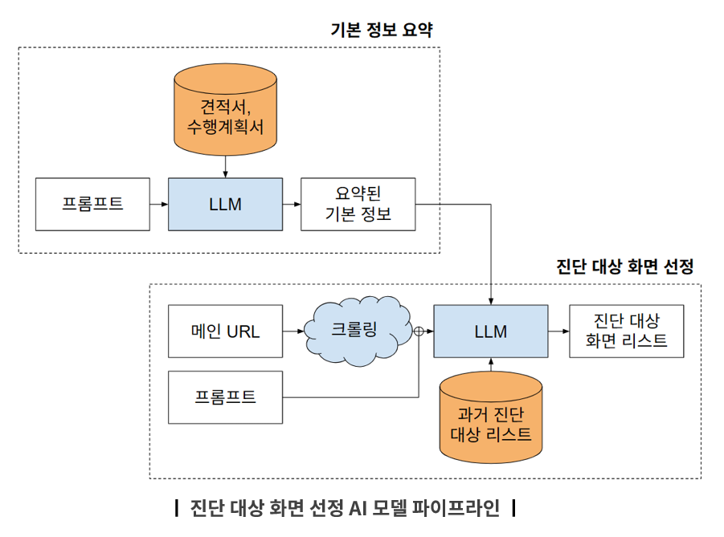
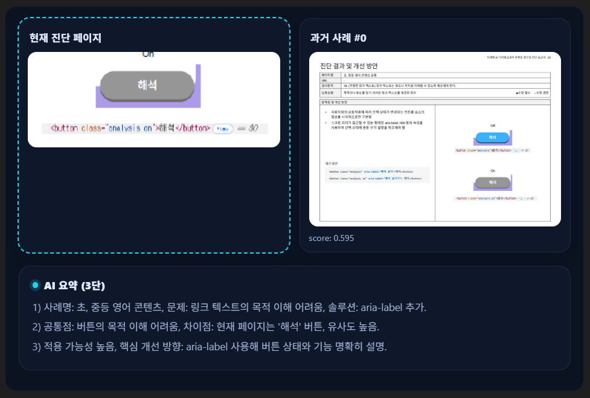

# SNC_Lab

## AI 기반 웹 접근성 진단 자동화 프로젝트 모음

SNC_Lab은 웹 접근성 진단 과정을 자동화하거나 보조하기 위한 프로젝트들을 모아둔 저장소입니다.  
주요 흐름은 다음과 같습니다.

1. **진단 대상 페이지 자동 표집**
2. **유사 페이지 탐색 및 재사용 지원**
3. **진단 결과 생성 모델 학습 및 추론**

---

## 프로젝트 구성

### 1. 01_assistModel
접근성 진단 보고서, 크롤링 데이터, 슬라이드 등에서 학습 데이터를 구성하고  
SFT 기반으로 진단 결과 생성 모델을 학습·추론하는 모듈입니다.

주요 역할:
- 보고서/문서 기반 학습 데이터 생성
- SFT 학습 파이프라인 구성
- 추론 및 결과 생성 자동화

#### 핵심 이미지


---

### 2. 02_diagScope
웹사이트 전체를 크롤링하여 **진단 대상 페이지를 자동으로 표집**하는 모듈입니다.  
페이지 URL, 메뉴 계층, 주요 UI 유형을 추출하고 진단 우선순위 선정에 필요한 구조화 결과를 만듭니다.

주요 역할:
- Selenium 기반 사이트 크롤링
- 메뉴 계층 구조 추출
- 테이블/리스트/이미지/팝업 등 주요 UI 라벨링
- Excel 결과 저장
- Streamlit 기반 실행 UI 제공

#### 핵심 이미지


> 만약 이미지가 안 보이면 실제 폴더명이 `assets`가 아니라 `assests`일 수 있으니 아래처럼 바꾸세요.
>
> ``

---

### 3. 03_simDetect
현재 진단 중인 페이지와 유사한 화면이나 사례를 찾기 위한 모듈입니다.  
텍스트, HTML, 이미지 등 다양한 정보를 활용해 유사 페이지를 검색하고 재사용 가능한 진단 맥락을 제공합니다.

주요 역할:
- 유사 페이지 검색
- 검색 결과 비교/추천
- 진단 중복 감소 및 재사용 지원

#### 핵심 이미지


> 위 경로는 예시입니다. 실제 이미지 파일명에 맞게 수정하세요.

---

## 디렉토리 구조

```text
SNC_Lab/
├─ 01_assistModel/
│  └─ assets/
├─ 02_diagScope/
│  └─ assets/   # 또는 assests/
├─ 03_simDetect/
│  └─ assets/
├─ AgenticAI/
├─ image/
└─ README.md